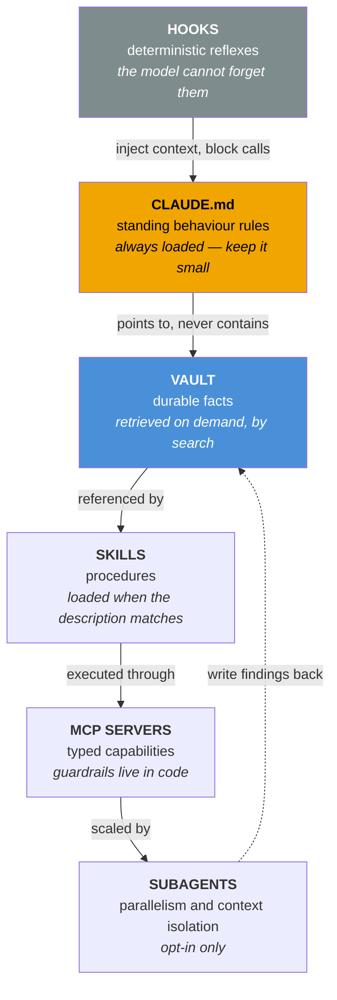

# The Claude Code Memory Stack

[](https://github.com/icatchstyle/Claude-Code-Memory-Stack/actions/workflows/ci.yml)
[](LICENSE)
[](https://www.python.org/downloads/)
[](CONTRIBUTING.md)

> A complete, opinionated, **runnable** template for giving Claude Code a persistent memory,
> a skill library, and an MCP layer — derived from a setup that has been in daily production
> use, then stripped of everything company-specific.

This is a working system rather than a reading list: a vault skeleton you copy, a `CLAUDE.md` you
fill in, hooks that fire on every turn, skills that trigger when you want them, and a reference MCP
server that runs. Everything is designed to be adopted incrementally — you can stop after Level 1
and still be better off.

**Contents** — [The problem](#the-problem-this-solves) · [What you get](#what-you-get) ·
[Quick start](#quick-start) · [The five ideas](#the-five-ideas-that-make-this-work) ·
[Adoption levels](#levels-of-adoption) · [Docs](docs/) · [Contributing](CONTRIBUTING.md)

---

## The problem this solves

Claude Code is excellent at reasoning over the code in front of it and **amnesiac about
everything else**. Every session it re-learns which database profile is safe to query, which
branch to fork from, that the container needs a restart after the mount goes stale, that the
build breaks if you edit the compiled CSS instead of the source.

You can paste that into a prompt. You will paste it again tomorrow.

The fix is not a longer `CLAUDE.md`. The fix is a **layered architecture** where each kind of
knowledge lives in the layer that can actually deliver it at the right moment:

| Layer | Holds | Loaded |
|---|---|---|
| `CLAUDE.md` | **Behaviour rules** — what the agent must and must not do | Always, every session |
| **Vault** | **Facts** — architecture, gotchas, decisions, runbooks | On demand, by search |
| **Skills** | **Procedures** — repeatable multi-step workflows | On trigger, by description match |
| **MCP servers** | **Capabilities** — typed access to systems and to the vault itself | On tool call |
| **Hooks** | **Reflexes** — deterministic enforcement the model cannot forget | On lifecycle event |
| **Subagents / workflows** | **Scale** — parallel and context-isolated execution | On explicit opt-in |

> **"Vault"** here means a plain folder of Markdown files, nothing more. The word comes from
> Obsidian, which makes such a folder pleasant to browse — but nothing in this template requires
> Obsidian, or any particular editor. If you prefer, read it as "knowledge base" throughout.

The single most important rule in this repo, and the one most setups get wrong:

> **`CLAUDE.md` is an instruction file, not a knowledge file.**
> Every fact you put in it is paid for in every single session, forever. Facts belong in the
> vault, where they are retrieved only when relevant. `CLAUDE.md` should tell the agent *how to
> find* the fact, never *what* the fact is.

---

## How the layers fit together

Each kind of knowledge lives in the layer that can deliver it at the right moment. Putting a fact
in the wrong layer is the single most common way these setups fail.



The dotted line is the part most setups never build: **the return path**. A knowledge base that is
only read goes stale, and a stale one is worse than none, because you stop trusting it.

---

## See it work

The reference server answers "what should I know before I touch this?" — *before* the mistake,
not after. Against the vault skeleton in this repository, straight out of the box:

```console
$ gotcha_check(context="docker container mount, deploying the vault server")

danger  The server reports "healthy" and finds nothing
        After a host-side re-sync the container's bind mount can point at a folder that no
        longer exists. Every read returns "not found" while the host path is visibly full.
        → GLOBAL/gotchas/docker/EXAMPLE-bind-mount-goes-stale.md

danger  Never copy a skill into the active location
        A copy drifts. You edit the vault version, nothing changes, and you lose an hour
        before noticing the active file is a stale twin.
        → SKILLS/INSTALLING.md

warning "Nothing" is a valid classification
        A session of dead ends should write nothing. A vault that records every session is
        a log, not a knowledge base.
        → GUIDELINES/vault/write-procedure.md
```

Three notes surfaced, ranked by severity, from a context line — because each one carries a
`> [!severity]` callout. **A note without that marker is invisible here.** That one convention is
what turns "notes about problems" into a warning system.

---

## What you get

```
.
├── README.md                     ← you are here
├── docs/                         ← the guide, one file per layer
│   ├── 01-architecture.md        the six layers and why they are separate
│   ├── 02-vault.md               vault structure, naming, indexes, callouts
│   ├── 03-claude-md.md           writing CLAUDE.md that survives contact with reality
│   ├── 04-skills.md              authoring skills that trigger when they should
│   ├── 05-mcp.md                 MCP servers, the single-daemon pattern, failure modes
│   ├── 06-hooks.md               hooks as enforcement, with working examples
│   ├── 07-scale.md               subagents, workflows, context economics
│   ├── 08-operations.md          maintenance, linting, backup, troubleshooting
│   ├── 09-adoption.md            day 1 → week 1 → month 1, in order
│   ├── 10-antipatterns.md        the failure modes, and what they cost
│   └── 11-automation.md          closing the write-back loop without discipline
├── Makefile                      make check — everything CI runs
├── setup/                        ← copy-and-edit runtime files
│   ├── bootstrap.sh              one command to lay the whole thing down
│   ├── CLAUDE.md.template        annotated, every rule explained
│   ├── settings.json.template    permissions, hooks, model, plugins
│   └── hooks/                    three working hooks (recall, session-name, notify)
├── vault-template/               ← the vault skeleton, ready to copy
│   ├── HOME.md, MAP.md           navigation entry points
│   ├── GLOBAL/ PROJECTS/ …       the folder taxonomy, each with an _INDEX.md
│   ├── SKILLS/                   two annotated example skills, where the docs say they belong
│   └── TEMPLATES/                note templates (gotcha, project, ADR, skill, …)
├── automation/                   ← the scheduled harvest: collector, runner, schedules
└── mcp/                          ← two small but real MCP servers
    ├── vault-mcp/                structured retrieval over the vault
    └── sqlite-mcp/               guardrails enforced in code, not in a prompt
```

---

## Quick start

```bash
# 1. Lay down the vault skeleton and the runtime files
./setup/bootstrap.sh --vault ~/vault --dry-run     # inspect first
./setup/bootstrap.sh --vault ~/vault

# 2. Fill in the two placeholders that matter
$EDITOR ~/.claude/CLAUDE.md          # your rules, your paths
$EDITOR ~/vault/HOME.md              # what lives where

# 3. (Optional but recommended) run the reference vault MCP server
cd mcp/vault-mcp && pip install -e . && VAULT_PATH=~/vault python -m vault_mcp
```

Then open Claude Code and ask it something you have answered before. If the answer comes back
without you re-explaining the context, the stack is working.

**No MCP server?** The whole design degrades gracefully. Without one, Claude reads the vault
with `Read`/`Grep` — slower and less structured, but functional. See
[`docs/05-mcp.md`](docs/05-mcp.md#running-without-an-mcp-server).

---

## The five ideas that make this work

Everything else in this repository is detail. These are the load-bearing ideas.

### 1. Recall must be mandatory, not optional

A rule that says "check the vault when relevant" is dead on arrival: the model cannot know that
a lookup was relevant until after it has done it. Missing knowledge leaves no gap in the context
that anything notices.

So the rule is inverted — **always look, with three named exemptions** (pure follow-up question,
bare confirmation, identical search already run this session) — and a `UserPromptSubmit` hook
re-injects that obligation every single turn, because a rule stated once at session start decays
as the conversation grows. See [`setup/hooks/memory-recall-reminder.sh`](setup/hooks/memory-recall-reminder.sh).

### 2. Knowledge must be written back, or the loop never closes

Reading is half the system. A setup that only reads is a setup that slowly goes stale. Every
session that discovers something non-obvious should end by writing it down — and the *writing*
side deserves its own skill, its own conventions, and its own quality bar. Case details
("customer 4711 had a duplicate order") are worthless; their transferable core ("duplicate
detection compares normalised e-mail, so case differences slip through") is gold.

### 3. Structure beats prose — machine-readable markers

Free-text notes are findable only by luck. Give the important classes of knowledge a **marker
the tooling can query**. In this template, gotchas open with an Obsidian callout carrying a
severity:

```markdown
> [!danger] Editing the compiled CSS is silently overwritten
> The build regenerates `dist/app.css` from LESS on every deploy.
```

That one convention turns "notes about problems" into a **queryable warning system** — a server
(or a grep) can answer "what should I know before touching Docker on this project?" A note
without the callout is invisible to that query. Structure is what makes retrieval reliable.

### 4. One source of truth, symlinked into place

Skills live in the vault (versioned, searchable, linked to the knowledge they depend on) and are
**symlinked** into `~/.claude/skills/`. Never copied. The moment you copy, the two drift, and
six weeks later nobody knows which one is real. Symlinks load live — edit the vault file, the
next invocation picks it up, no restart.

### 5. Determinism where it matters

Anything that must happen *every* time — a reminder, a rename, a container health check, a
notification — belongs in a **hook**, not in an instruction. The model follows instructions
well; hooks follow them perfectly. Reserve the model's judgement for the parts that need
judgement.

---

## Levels of adoption

You do not need all of it. Pick a level and stop there.

| Level | You add | Time | You get |
|---|---|---|---|
| **1 — Rules** | `CLAUDE.md` only | 30 min | Consistent behaviour, no more repeating preferences |
| **2 — Memory** | Vault skeleton + recall rule | half a day | Facts survive the session; stop re-explaining architecture |
| **3 — Reflexes** | Hooks | 1 hour | Recall becomes reliable rather than hopeful |
| **4 — Procedures** | Skills | ongoing | Multi-step workflows become one word |
| **5 — Capabilities** | MCP servers | 1 day | Typed, safe access to your systems and your vault |
| **6 — Scale** | Subagents, workflows | as needed | Parallel work without drowning your context |

Full sequencing, with what to do first and what to defer: [`docs/09-adoption.md`](docs/09-adoption.md).

---

## What this is not

- **Not a plugin.** Nothing here installs itself into Claude Code. It is files you own and edit.
- **Not tied to one vendor.** The vault is plain Markdown. Obsidian makes it pleasant (graph,
  backlinks, callouts) but nothing here requires it.
- **Not a prompt collection.** Prompts are the least durable part of an agent setup. Structure
  is the durable part.
- **Not finished.** A memory stack is a garden, not a building. See
  [`docs/08-operations.md`](docs/08-operations.md).

---

## Credits & licence

Distilled from a Claude Code setup in daily use (~1,600 vault notes, ~55 skills, 7 MCP servers)
and generalised. Take it, fork it, make it yours — the conventions matter more than the specific
folder names.

- **Contributing:** [`CONTRIBUTING.md`](CONTRIBUTING.md) — what is in scope, and how to check your
  work before opening a pull request
- **Security:** [`SECURITY.md`](SECURITY.md) — reporting, plus the design decisions that are
  deliberate rather than oversights
- **Conduct:** [`CODE_OF_CONDUCT.md`](CODE_OF_CONDUCT.md)
- **History:** [`CHANGELOG.md`](CHANGELOG.md)
- **Licence:** [MIT](LICENSE)
