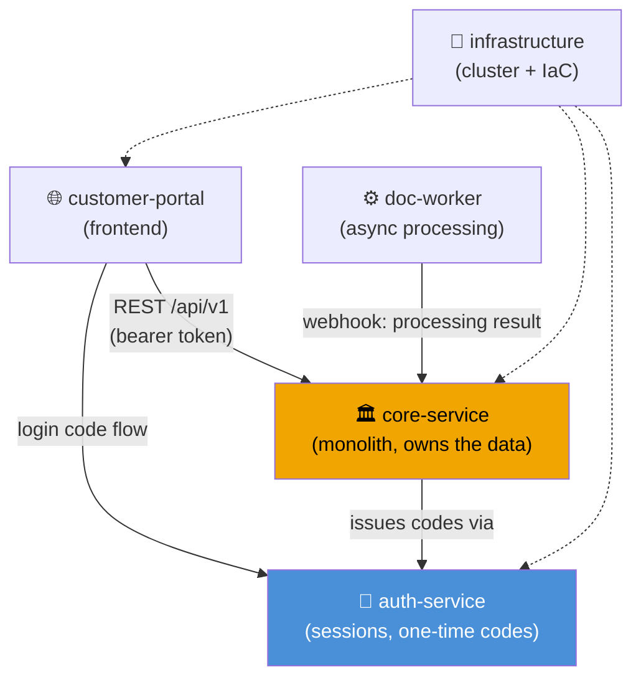

# System map

Which system reads from which? Which calls which? This answers the question a new task starts
with: *if I change this, what else notices?*

## Dependency graph

<!-- Replace the above with your real systems. Keep the EDGE LABELS: the protocol and the
     mechanism are the parts that actually help. A graph of boxes with unlabelled arrows
     tells you nothing you did not already know. -->

## Cluster overview

| System | Cluster | Status | Stack | upstream | downstream |
|---|---|---|---|---|---|
| core-service | core | active | `<stack>` | — | portal, worker |
| customer-portal | core | active | `<stack>` | core, auth | — |
| auth-service | core | active | `<stack>` | — | core, portal |
| doc-worker | platform | active | `<stack>` | — | core |

## Shared contracts

Contracts bind several systems together and are the most expensive thing to get wrong. Give each
one its own note and link it from every system that depends on it.

- [[GLOBAL/architecture/api-auth-contract|API auth contract]] — token format and lifetime
- [[GLOBAL/architecture/shared-database|Shared database]] — who may write which tables

## Navigation

- [[HOME|Home]]
- [[PROJECTS/_INDEX|All projects]]

> [!info] The two links above are deliberately dangling
> `api-auth-contract` and `shared-database` do not exist yet. A dangling wikilink is a to-do
> marker, not an error — it records that the note is worth writing. Keep a short allow-list of
> intentional ones so your health report stays signal, not noise.
